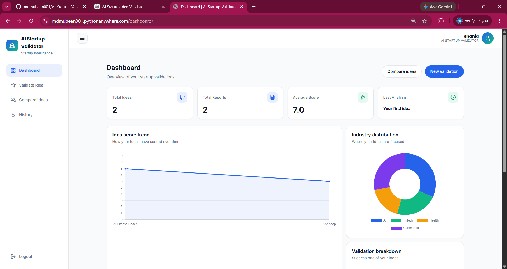
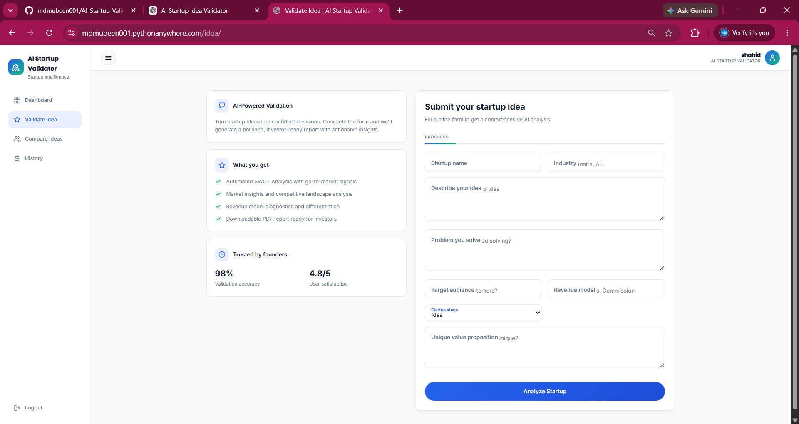
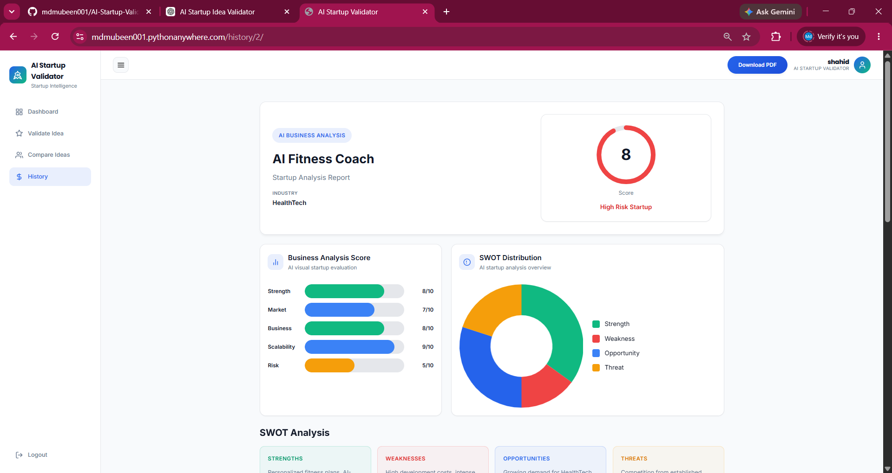
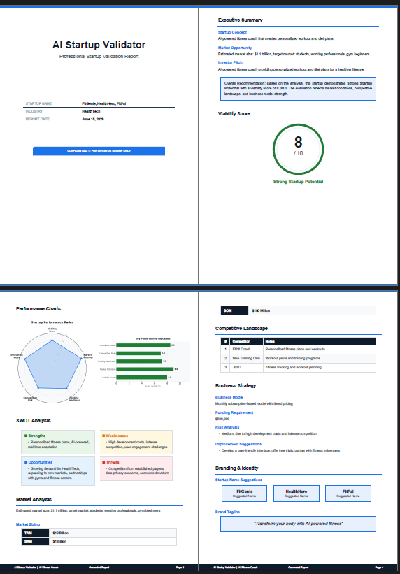

# 🚀 AI Startup Validator

An AI-powered web application that helps entrepreneurs validate startup ideas using market analysis, SWOT insights, business strategy recommendations, and investor-ready PDF reports.

🔗 **Live Demo:** https://mdmubeen001.pythonanywhere.com/

---

## ✨ Features

- 🤖 AI-powered startup idea validation using **Groq API**
- 📊 SWOT analysis generation
- 📈 Startup viability scoring
- 🏢 Market and competitor analysis
- 💰 Revenue model suggestions
- 📝 Investor-ready PDF report generation
- 📂 Report history and management
- ⚖️ Compare multiple startup ideas
- 📱 Fully responsive UI for desktop and mobile
- 🔐 User authentication system (Register/Login)

---

## 🛠️ Tech Stack

### Backend
- Django
- Python
- SQLite
- Groq API

### Frontend
- HTML
- CSS
- JavaScript
- Chart.js

### Deployment
- PythonAnywhere
- GitHub

### PDF Generation
- ReportLab

---

## 📸 Screenshots

### Homepage
.png)

### Dashboard


### Startup Validation Form


### Analysis Result


### Generated PDF Report


---

## ⚙️ Installation

### Clone the repository

```bash
git clone https://github.com/mdmubeen001/AI-Startup-Validator.git
cd AI-Startup-Validator
```

### Create virtual environment

```bash
python -m venv venv
```

### Activate virtual environment

Windows:

```bash
venv\Scripts\activate
```

Linux/Mac:

```bash
source venv/bin/activate
```

### Install dependencies

```bash
pip install -r requirements.txt
```

### Create `.env` file

```env
GROQ_API_KEY=your_api_key_here
```

### Run migrations

```bash
python manage.py migrate
```

### Start development server

```bash
python manage.py runserver
```

---

## 📁 Project Structure

```
AI-Startup-Validator/
│
├── accounts/
├── startup/
├── validator/
├── static/
├── screenshots/
├── manage.py
├── requirements.txt
└── README.md
```

---

## 🎯 Future Improvements

- Export reports in DOCX format
- Email report delivery
- Team collaboration support
- Advanced startup benchmarking
- AI chatbot assistant for founders

---

## 👨‍💻 Author

**Mohammed Mubeen**

- GitHub: https://github.com/mdmubeen001
- LinkedIn: https://www.linkedin.com/in/mohammed-mubeen-389b27247/

---

## ⭐ Support

If you found this project useful, consider giving it a **star ⭐** on GitHub.
